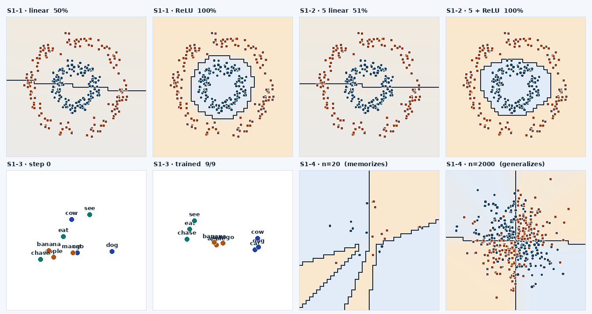
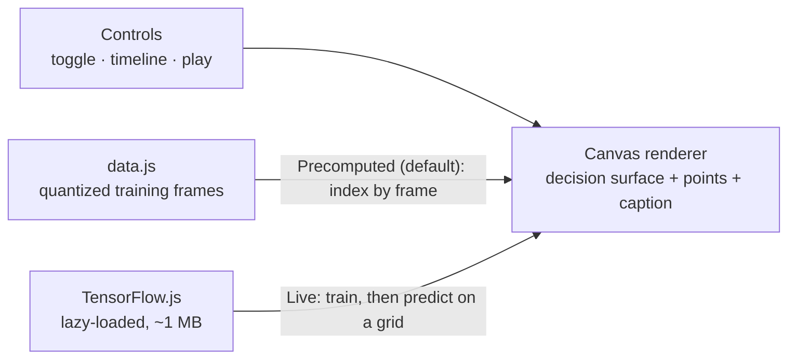
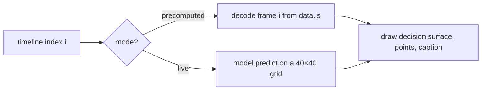
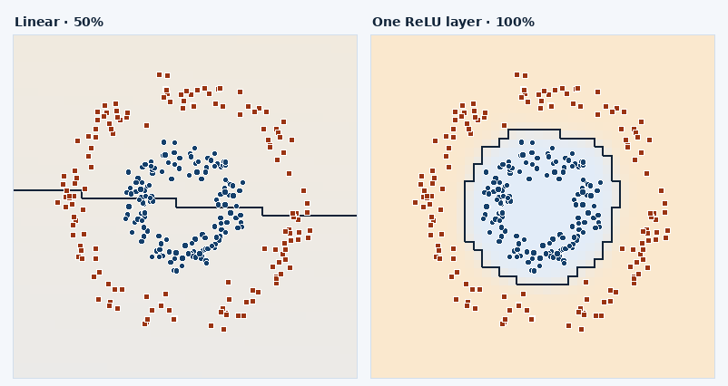
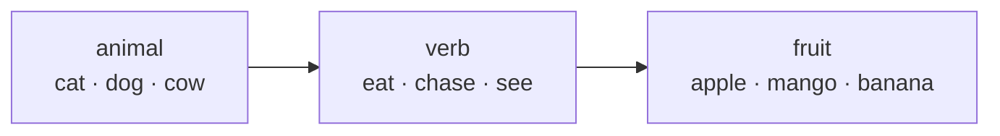
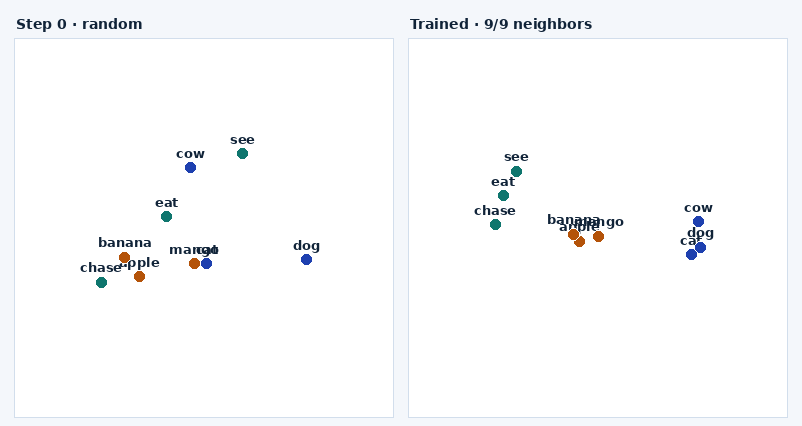
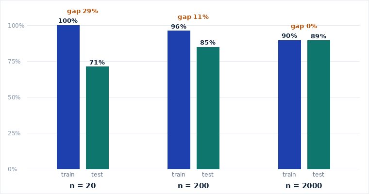

# ERA V5 · Session 1 — Four Proofs

An interactive web app that proves the four core claims of Session 1 ("From Neural Networks to the
Transformer"). Each proof is a tiny neural net you scrub through frame by frame: instant by default
(precomputed), or trained live in your browser with [TensorFlow.js](https://www.tensorflow.org/js)
at the flip of a toggle.

Built for the Axiom **Learning OS** · ERA V5 · Session 1 Assignment QnA (500 pts).



*Rendered from the app's own precomputed data: the linear models stay a straight line near 50%, ReLU
wraps the ring at 100%, the embeddings separate into three clusters, and the generalization gap closes
as the dataset grows.*

---

## The four proofs

| # | Claim | Result in the app |
|---|-------|-------------------|
| **S1-1** | Activations exist for a reason. | Linear + sigmoid stalls at ~50% (a straight line); one ReLU or Tanh hidden layer reaches ~100% (a closed loop). |
| **S1-2** | Depth without nonlinearity is a lie. | 1 linear and 5 linear layers give the same line and accuracy; the five weight matrices multiply to a single 2×1 map. 5 + ReLU reaches 100%. |
| **S1-3** | Embeddings learn similarity from next-token alone. | A 2-D embedding table, trained only to predict the next token, separates 9 words into 3 category clusters (9/9 same-category nearest neighbors). |
| **S1-4** | Memorization vs generalization. | The same 64×64 net memorizes 20 points (train 100%, test 71%); at 2000 points the train/test gap drops to ~0. |

---

## How it works

Two modes share one renderer. A glass toggle in the header switches between them.



- **Precomputed (default).** Training trajectories are computed ahead of time and stored in `data.js`
  as quantized decision-boundary frames, embedding snapshots, and accuracies. The timeline scrubber
  indexes frames, so it stays smooth on any laptop and needs no GPU. Fully static and offline.
- **Live · TensorFlow.js.** The toggle trains each proof in the browser. TF.js loads only when you
  switch, then the same renderer draws the live result.

Both paths feed the same drawing code:



---

## S1-1 · Activations



Same 300 ring points, same training. The linear model can only rotate a straight line, so it sits
near chance. One nonlinear layer bends the surface into a loop that fences off the inner ring.

## S1-3 · Embeddings from next-token

Every sentence in the toy grammar follows one rule, so the only signal is which word tends to follow
which. Same-category words share that pattern.



Training pairs come from that chain: `(animal → verb)` and `(verb → fruit)`. No coordinates, labels,
or similarity are given, yet the embeddings settle into three clusters.



## S1-4 · Data closes the gap

The same over-parameterized net, three dataset sizes. The gap between train and test accuracy shrinks
as the dataset grows.



---

## What's under the hood

All experiments are tiny by design, so live training finishes in seconds.

| Proof | Dataset | Model(s) | Optimizer | Epochs | Timeline frames |
|-------|---------|----------|-----------|--------|-----------------|
| S1-1 | 300 ring points (noise 0.055) | `2→1` sigmoid · `2→16→1` ReLU · `2→16→1` Tanh | Adam | 70 | 11 |
| S1-2 | same ring points | `2→1` · `2→8→8→8→8→1` linear · `2→16→16→16→16→1` ReLU | Adam | 80 | 11 |
| S1-3 | toy grammar, 2000 sentences | `embedding(9→2) → softmax(9)` | Adam | 140 | 16 |
| S1-4 | noisy XOR-sign, 10% label noise | `2→64→64→1` ReLU, sizes 20 / 200 / 2000 | Adam | 400 / 200 / 90 | 11 |

Decision surfaces are stored at 40×40 resolution, quantized to one byte per cell, base64-encoded in
`data.js` (≈240 KB total).

### Validated results

Every claim was reproduced three ways: a NumPy reference (which also generates `data.js`), the live
TensorFlow.js code run in Node, and rendered previews of the visuals.

| Proof | Measurement | Value |
|-------|-------------|-------|
| S1-1 | linear accuracy | ~50% (a straight line) |
| S1-1 | ReLU / Tanh accuracy | ~100% |
| S1-2 | 1-linear vs 5-linear | identical line, ~50% |
| S1-2 | collapsed weight map | `W_eff = [0.0156, 0.3823]ᵀ`, shape 2×1 |
| S1-2 | 5 + ReLU accuracy | ~100% |
| S1-3 | next-token loss | → ln 3 ≈ 1.10 (the floor) |
| S1-3 | same-category neighbors | 9 / 9 |
| S1-4 | train / test gap | 0.29 (n=20) → 0.11 (n=200) → 0.003 (n=2000) |

The S1-3 loss settles near 1.10 rather than 0 because the next word is one of three. The clustering is
the proof, not the loss.

---

## Design

The visual direction came from the **UI/UX Pro Max** plugin, tuned to match the Axiom LMS.

- **Palette:** a WCAG-checked analytics scheme, blue data (`#1E40AF` / `#3B82F6`) with amber highlights
  (`#D97706`) on a cool `#F4F7FB`, plus the LMS cyan as accent.
- **Class markers** use both hue and shape (navy circle vs rust diamond) so they read without color.
- **Type:** IBM Plex Sans for UI, JetBrains Mono for numbers and code, with tabular figures.
- **Interaction** follows the instructor's own Session-1 widgets: a thesis, a control bar (segmented
  toggles, play, a scrubbable timeline), a live canvas, and a caption that updates as you scrub.
- Respects `prefers-reduced-motion`, keeps visible focus rings, and uses 44 px touch targets.

---

## Run locally

```bash
cd webapp
python3 -m http.server 8000   # then open http://localhost:8000
```

Opening `index.html` directly works too; live mode needs internet for the TF.js CDN.

## Deploy

See [`DEPLOY.md`](./DEPLOY.md). Deploy the whole folder (it needs `index.html` and `data.js`). Fastest
path: drag the `webapp` folder onto [Netlify Drop](https://app.netlify.com/drop), then sign in to keep
the URL.

---

## File structure

```
webapp/
├── index.html         # the app: markup, design system, interaction + render logic
├── data.js            # precomputed training trajectories (~240 KB)
├── generate_data.py   # NumPy generator that produces data.js (reproducibility)
├── assets/            # rendered figures used in this README
├── README.md          # this file
├── DEPLOY.md          # Netlify deployment steps
└── push_to_github.sh  # one-shot helper to publish this folder to GitHub
```

Only `index.html` + `data.js` are needed to run or deploy. Regenerate the data with
`python3 generate_data.py`.

---

*Course: ERA V5 · Session 1 · From Neural Networks to the Transformer · Axiom Learning OS.*
